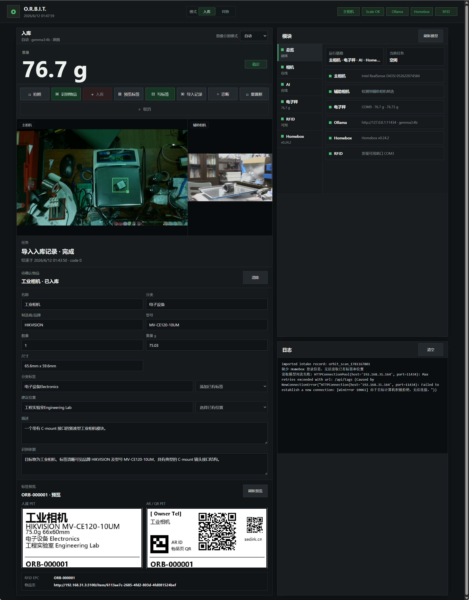

# O.R.B.I.T.

**Object Recognition, Binning, and Intelligent Tracking**

O.R.B.I.T. 是一个面向工作室、实验室和零件仓的半自动物品管理平台。它把 RGB-D/USB 摄像头、电子秤、本机/局域网/云端视觉语言模型、Homebox、PET 标签打印机和 RFID 读写器接到同一个网页 GUI 中，用一条可确认、可恢复、可追溯的流程完成入库和找物。



当前版本的重点是两种模式：

- **入库**：拍照、框选、识别、人工编辑、写入 Homebox、打印 PET 标签、写入 RFID 标签。
- **找物**：通过 Homebox 文本检索和 RFID 盘点辅助定位已入库物品。
- **界面**：网页控制台默认使用明亮主题，也可切换并记住深色主题。

## 当前能力

- 网页控制台默认监听 `0.0.0.0:8765`，局域网设备可通过本机 IP 访问。
- 主相机用于俯拍识别和尺寸估算，当前优先支持 Intel RealSense D435i 的 RGB-D 数据。
- 辅助相机可配置为任意 USB 摄像头，用于补充侧面、品牌、型号和标签信息。
- 图像分割模式支持 `auto`、`scale`、`macro`、`full`、`furniture`，默认使用 `auto`。
- 支持自动框选加手动确认；识别前的最终框选由用户确认，避免把称盘、背景杂物或辅助视角误当作目标。
- 电子秤通过串口读取重量，重量不从图像或 AI 结果推断。
- AI 支持本机 Ollama、局域网 Ollama 和 OpenAI 兼容云端接口；GUI 可读取当前服务上的模型列表，并选择图像降采样策略。
- Homebox 支持登录、读取已有标签和位置、严格复用已有标签/位置、创建物品、上传照片、写入自定义字段。
- 若输入了 Homebox 中不存在的位置，GUI 会要求确认后再创建新位置，避免 Homebox 500 错误。
- 标签模块支持 40 mm x 20 mm PET 标签预览和打印：人读标签、AR/QR 标签、RFID EPC；预览使用与 TSPL 相同的 1-bit 点阵，并按黑色 PET、白色碳带显示物理成品效果。
- RFID 模块支持 E710/IE701 串口读写、盘点候选标签、按 RSSI 默认选中最强标签、写入前确认、写入后复读校验。
- 找物模式将 Homebox 数据库检索和 RFID 盘点拆成独立标签页，RFID 盘点不会覆盖数据库搜索结果。
- 每次 Homebox 入库和写标签会保存本地 `.orbit-intake.json` 记录，可在 GUI 中导入恢复当时的物品状态。

## 硬件拓扑

| 模块 | 当前测试设备 | 用途 |
| --- | --- | --- |
| 主相机 | Intel RealSense D435i | 俯拍 RGB-D、框选、尺寸估算、主图识别 |
| 辅助相机 | Logitech C270 或其他 USB 摄像头 | 侧面补充视角、品牌/型号/标签读取 |
| 电子秤 | RS232/USB 电子秤 | 稳定重量读取 |
| RFID | E710/IE701 读写板，CP210x USB-UART | EPC 读取、RSSI 盘点、EPC 写入 |
| 标签打印机 | TSC TTP-244 Pro | 40 mm x 20 mm PET 标签打印 |
| 数据后台 | Homebox | 物品、位置、标签、照片和字段管理 |
| AI 推理 | 本机 Ollama、局域网 GPU 主机或 OpenAI 兼容云端 API | 视觉语言模型识别 |

## 软件结构

| 路径 | 说明 |
| --- | --- |
| `VISION/web_gui.py` | 网页控制台后端，提供 HTTP API、状态轮询、任务执行和硬件控制 |
| `VISION/web/` | 网页控制台前端 |
| `VISION/main.py` | 命令行入口，包含诊断、拍照、识别、称重、RFID 等命令 |
| `VISION/vision.py` | 图像采集、分割、框选、曝光补偿、尺寸估算和 AI 数据规范化 |
| `VISION/scale.py` | 电子秤串口读取 |
| `VISION/homebox.py` | Homebox API 客户端 |
| `VISION/labels.py` | 标签预览、TSPL 生成、打印、二维码和 RFID EPC 编码 |
| `VISION/rfid_e710.py` | E710/IE701 串口协议封装 |
| `VISION/start_web_gui.ps1` | Windows 一键启动网页 GUI |
| `VISION/add_web_gui_firewall_rule_admin.ps1` | 添加局域网访问防火墙规则 |
| `VISION/install_cp210x_driver_admin.ps1` | 安装 CP210x 串口驱动 |
| `VISION/start_ollama_vulkan.ps1` | 本机 Ollama/Vulkan 实验启动脚本 |
| `VISION/logs/` | 运行时图片、AI 结果和临时文件，默认不提交 |
| `VISION/intake_records/` | 入库恢复记录，默认不提交 |

## 环境安装

项目使用 Conda 环境：

```powershell
conda env create -f environment.yml
conda activate orbit
```

如果环境已存在：

```powershell
conda env update -f environment.yml --prune
conda activate orbit
```

## 运行配置

建议通过环境变量配置外部服务、串口和私人信息，不要把账号密码写进仓库。

```powershell
$env:HOMEBOX_URL = "http://192.168.31.3:3100"
$env:HOMEBOX_USERNAME = "<homebox account>"
$env:HOMEBOX_PASSWORD = "<homebox password>"

$env:OLLAMA_API_URL = "http://127.0.0.1:11434/api/chat"
$env:OLLAMA_MODEL = "gemma3:4b"

$env:ORBIT_AI_TARGET = "local" # local / lan / cloud
$env:ORBIT_CLOUD_PROVIDER = "openai" # openai / gemini
$env:ORBIT_AI_API_BASE = "https://api.openai.com/v1"
$env:ORBIT_AI_API_KEY = "<openai-compatible api key>"

$env:SCALE_PORT = "COM9"
$env:RFID_PORT = "COM3"

$env:ORBIT_OWNER_NAME = "<owner name>"
$env:ORBIT_OWNER_PHONE = "<owner phone>"
$env:ORBIT_LABEL_STOCK_COLOR = "#000000"
$env:ORBIT_LABEL_RIBBON_COLOR = "#FFFFFF"
```

启动 GUI：

```powershell
.\VISION\start_web_gui.ps1
```

或直接启动：

```powershell
python .\VISION\web_gui.py --host 0.0.0.0 --port 8765
```

本机访问：

```text
http://127.0.0.1:8765
```

局域网访问：

```text
http://<本机局域网 IP>:8765
```

如果其他机器打不开 GUI，请先确认 Windows 防火墙允许 `8765` 端口：

```powershell
Start-Process powershell -Verb RunAs -ArgumentList "-ExecutionPolicy Bypass -File .\VISION\add_web_gui_firewall_rule_admin.ps1"
```

## 入库流程

1. 选择 **入库** 模式。
2. 将物品放到电子秤称盘上，等待重量稳定。
3. 点击拍照，确认主相机和辅助相机画面正常。
4. 调整绿色框选，使其覆盖完整待入库物品。
5. 点击识别，系统将主视角、框选信息、辅助视角和电子秤重量传给视觉模型。
6. 在 GUI 中编辑名称、分类、品牌、型号、数量、重量、尺寸、标签、位置、描述和识别依据。
7. 点击入库，将物品写入 Homebox。写入后属性不会立刻清空，方便继续打标签或补救。
8. 预览标签，确认内容和二维码尺寸。
9. 点击写标签，按配置打印 PET 标签并写入 RFID 标签。
10. 写入完成后可点击清除，进入下一个物品。

## 找物流程

1. 选择 **找物** 模式。
2. 用名称、编号、品牌、型号、位置或标签搜索 Homebox 物品。
3. 左侧结果区可在 **Homebox** 和 **RFID** 两个标签页之间切换；两边状态相互独立。
4. 使用 RFID 盘点读取天线附近 EPC，并尝试匹配 Homebox 中的 O.R.B.I.T. 编号。
5. 打开匹配物品后，可查看位置、标签、编号和 Homebox 链接。
6. 点击 **搜索 RFID** 可持续刷新目标标签的 RSSI、天线和更新时间；停止搜索或切换物品后轮询自动结束。

RFID 盘点结果按已匹配物品优先、RSSI 强度优先排序；未匹配标签会保留 EPC、RSSI 和天线信息，方便判断附近是否有未登记或旧规范标签。

找物模式仍在迭代，后续计划接入更完整的位置树、批量盘点和数字孪生场景。

## Homebox 约定

- `name`：人能快速理解的物品名称。
- `manufacturer`：制造商或品牌，例如 `Canon`、`HIKVISION`、`Guanglu`。
- `modelNumber`：真实型号或规格，不要把品牌重复写入型号。
- `tags`：作为性质分类使用，优先逐字严格复用 Homebox 已有标签。
- `suggested_location`：优先逐字严格复用 Homebox 已有位置；不存在时需确认创建。
- `weight`：只来自电子秤。
- `measured_size`：来自框选和深度估算，仅作辅助参考。
- `notes`：保存 AI 推理依据、入库时间、尺寸和识别上下文。

`General`、`AI识别`、`O.R.B.I.T.` 等系统或测试来源标签不应作为正式业务分类标签。

## 标签、RFID 和资产编号

新入库物品使用 10 位纯数字资产码作为底层编号：

```text
YYMMDDNNNN
```

例如 `2607060001` 表示 `2026-07-06` 当天第 `0001` 个入库物品。

- Homebox `assetId`：写入纯数字资产码，例如 `2607060001`。
- RFID EPC：写入同一个纯数字资产码的 ASCII 字节，例如 `2607060001`。
- GUI/PET 显示码：在纯数字资产码前加显示前缀，例如 `ORB-2607060001`。
- GUI 的“资产编号”编辑框只填写纯数字资产码，不填写 `ORB-` 显示前缀。
- Homebox 可能会把 `assetId` 自动格式化显示，例如 `2607060001` 显示为 `260-7060001`；读取和匹配时 O.R.B.I.T. 会还原为纯数字规范码。

这样 `ORB-` 只作为人读显示前缀，不占用 RFID EPC 字节；RFID 与 Homebox 仍保持同一个可互相推导的底层编号。

- 人读 PET 标签：物品名、品牌/型号、重量、尺寸、分类标签、位置和显示码。
- AR/QR PET 标签：所有者姓名与电话、物品名、显示码、AR ID 图形和 Homebox 物品页二维码。
- RFID 标签：写入 96-bit EPC 范围内的纯数字资产码，默认 10 bytes / 80 bits。

二维码当前只写入 Homebox 物品页 URL：

```text
http://<homebox-host>/item/<item-id>
```

RFID 写入前会先盘点标签并弹出确认页。请尽量保证天线前只有目标标签；若读到多个标签，默认选中 RSSI 最强的标签。

## 入库记录

GUI 会在以下时机保存 `.orbit-intake.json`：

- Homebox 入库成功后。
- PET/RFID 标签写入成功后。
- 用户手动保存当前入库状态时。

记录文件包含 GUI 可恢复状态、Homebox 物品摘要、标签/RFID 写入结果和相关运行时文件索引。格式包含 `schema`、`schema_version`、`min_reader_schema_version`，用于后续版本兼容。

默认保存目录：

```text
VISION/intake_records/
```

该目录默认在 `.gitignore` 中排除，因为记录中可能包含内网 Homebox URL、物品信息、图片路径和本地硬件状态。

## 常用命令

系统诊断：

```powershell
python .\VISION\main.py diagnose
```

读取电子秤：

```powershell
python .\VISION\main.py scale --port COM9
```

读取 RFID：

```powershell
python .\VISION\main.py rfid-read --rfid-port COM3
```

写入 RFID EPC：

```powershell
python .\VISION\main.py rfid-write --rfid-port COM3 --epc-hex 32363037303630303031
```

拍摄主相机图像：

```powershell
python .\VISION\main.py capture
```

启动完整监听流程：

```powershell
python .\VISION\main.py run
```

## 隐私和开源注意事项

仓库默认排除以下本地数据：

- `.env`、`.env.*`
- `VISION/logs/`
- `VISION/intake_records/`
- 图片文件 `*.jpg`、`*.jpeg`、`*.png`、`*.bmp`
- 本地驱动包 `VISION/drivers/`

提交前仍建议扫描一遍：

```powershell
rg -n "HOMEBOX_PASSWORD|HOMEBOX_TOKEN|password|token|secret" .
```

## 已知限制

- D435i 深度分割对黑色、透明、反光和复杂背景物体不稳定，仍需要人工框选确认。
- RealSense 硬件 ROI 曝光在部分设备组合上可能返回 `Invalid parameter`，当前主要使用软件曝光补偿和图像增强。
- 本机 4GB 显存运行视觉语言模型速度有限，正式入库建议使用局域网高显存 GPU 主机上的 Ollama 或 OpenAI 兼容云端模型。
- 视觉模型可能混淆品牌、规格和型号，入库前必须人工确认。
- RFID 当前主要写 EPC 区，不锁卡、不写 User 区。
- 找物模式仍处于早期阶段，RFID RSSI 可用于近距离信号搜索，但尚未完成方向估计和 3D/Unity 数字孪生。

## 路线图

- 改进纯视觉或远程 SAM 类分割，减少对深度分割的依赖。
- 完善找物模式：位置树、RFID RSSI 趋势可视化、批量盘点和物品详情页。
- 增加标签模板编辑器，支持不同纸张和不同信息密度。
- 支持 RFID User 区写入、重复写保护和更完整的写入校验。
- 将 Homebox 位置树、物品照片和 3DGS/Unity 场景关联，形成可检索的数字孪生。
